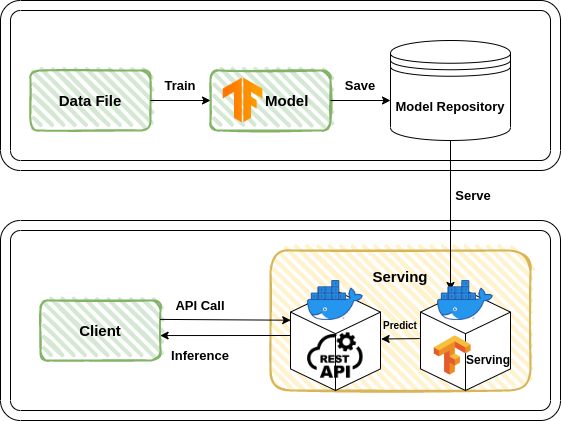

Restful API Server for Model Serving with Tensorflow Serving
=============
Tensorflow Serving을 이용하여 Fastapi로 구현한 Model Serving 서버입니다.<br> 

## Environments
1. Python3.8
2. Docker 1.42 (minimum 1.12)
3. Ubuntu 20.04

## Installing dependencies
1. Create virtualenv
```sh
$ pip3 install virtualenv
$ virtualenv env
$ source env/bin/activate
```
2. Install dependencies
```sh
$ git clone https://github.com/teeinn/Restful_API_Serving_Server.git
$ cd Restful_API_Serving_Server
$ pip install -r requirements.txt
```

## How to train
1. Prepare valid csv file
2. Run the jupyter notebook train.ipynb

## How to run
1. Build services using docker-compose.yml
```sh
$ docker-compose up
```

## How to inference
2. type 'http://localhost:8000/docs' in address bar
3. upload your test csv file

## Restful API interfaces
1. GET
- "/v1/health/live": check serving server alive
2. POST
- "/v1/models/random_forest/infer": return inference results of your input csv file

## Model & Metrics
1. Model: Random Forest
- 과적합 방지: 훈련 데이터에서 무작위로 샘플을 선택해 다양한 결정 트리를 생성한다. 
- Ensemble 모델: 다수의 결정 트리를 조합해 예측을 수행해 보다 정확하다.
- 다양한 데이터 유형 처리: 범주형 및 연속형 변수를 모두 처리할 수 있다.
2. Metrics: Accuracy 
- Accuracy: 예측된 클래스 레이블과 실제 클래스 레이블이 얼마나 일치하는지를 측정하는 지표

## Architecture Diagram for Serving Server
